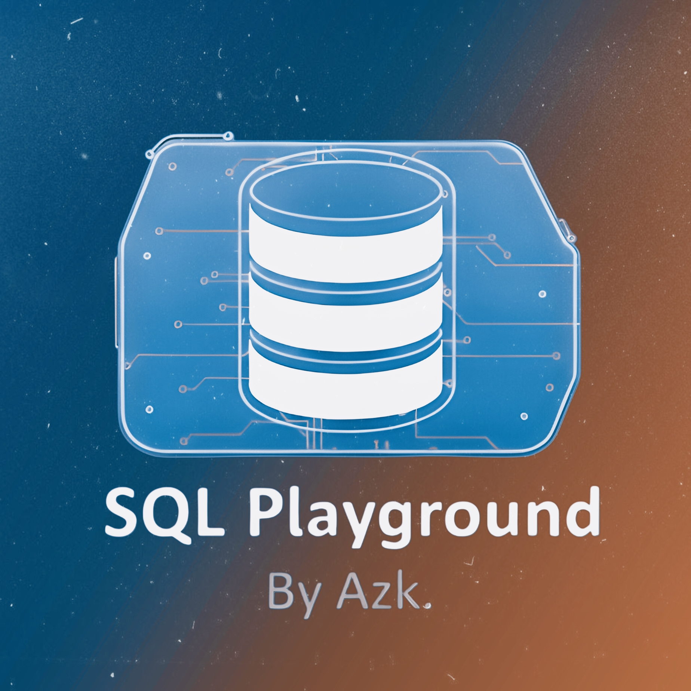
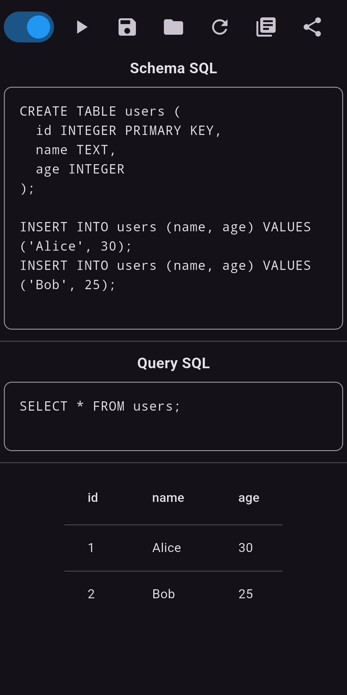
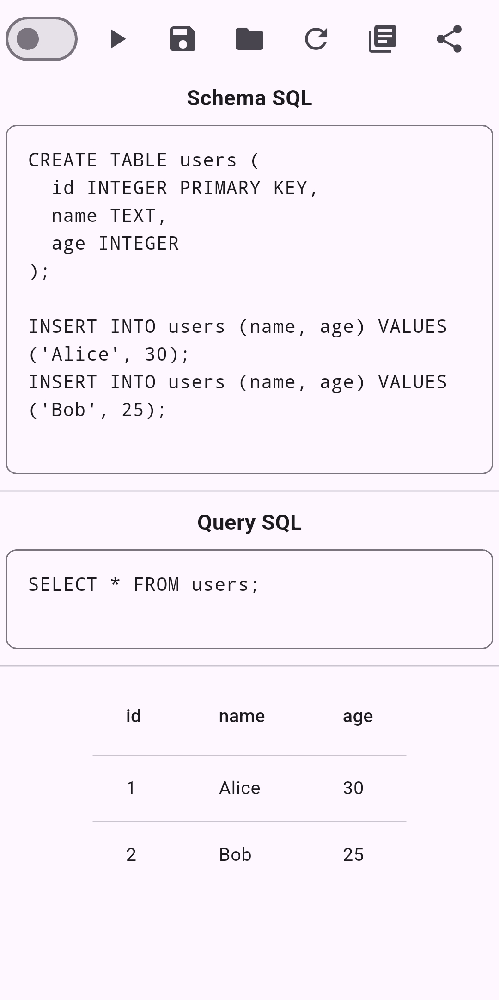

# SQL Playground

  

  <b>Practice • Save • Share SQL Queries</b>

**Version:** v1.1.1

SQL Playground is a simple Android app to practice and test SQL queries in a playground-style environment.  
Built for learning, experimenting, and quick SQL testing — anytime, anywhere.

## 🚀 Features
- ✍️ Write and run SQL queries
- 💾 Save queries for later use
- 🔗 Share SQL code instantly
- 🌗 Light & Dark mode support
- ⚡ Clean and fast UI

## 📦 Download APK
👉 [Download APK](https://drive.google.com/file/d/1kRnRw7cnsXTZX5mmjTzJfuWDpzw1IOtJ/view?usp=sharing)

## 📸 Screenshots

  
  
  
  

---

> Made With ❤️&☕ By Azk 💗

